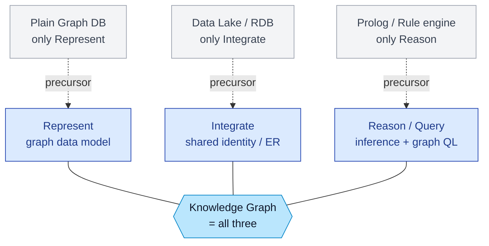
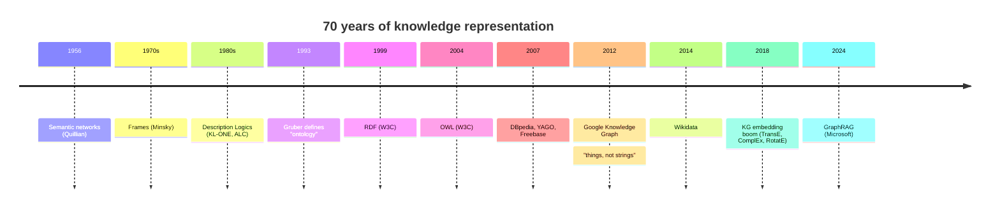
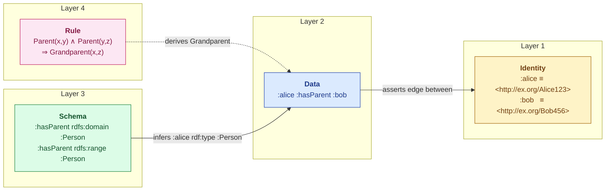
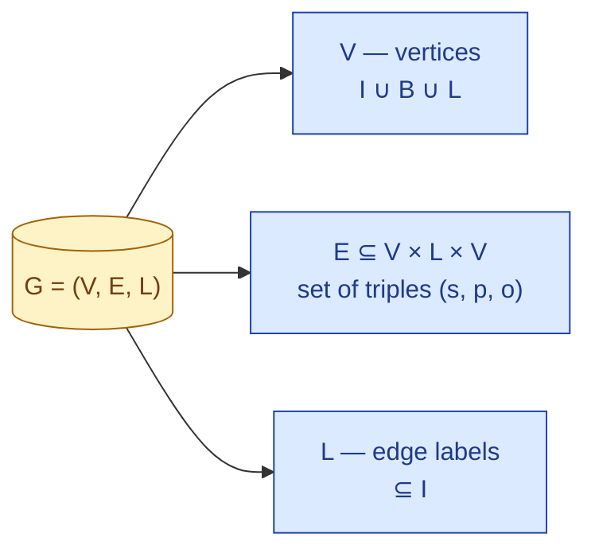
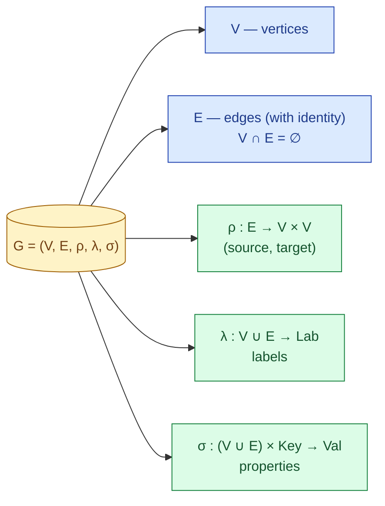
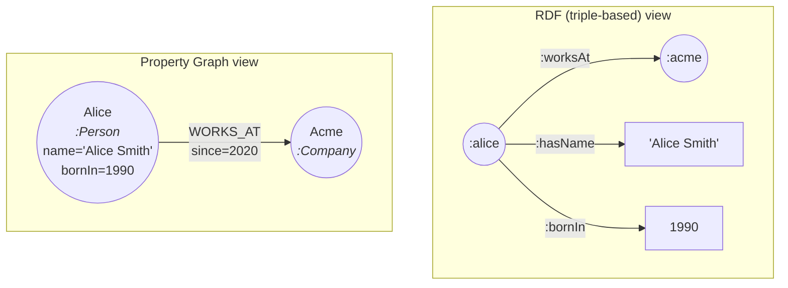
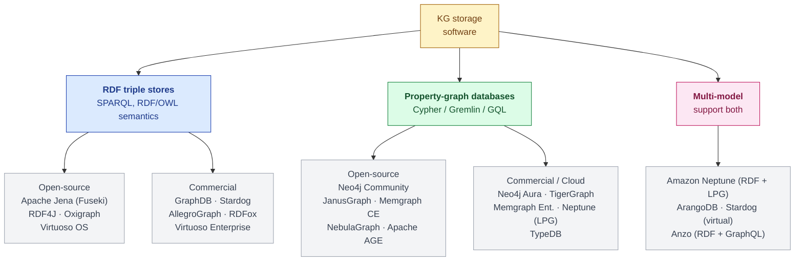

# What are Knowledge Graphs

A **Knowledge Graph** is a graph-structured representation of real-world entities and the relationships between them, intended to accumulate and convey knowledge that can be queried, reasoned over, and continuously enriched.

This summary sits between the two definitions every survey cites:

| Source                     | Definition                                                                                                                                                                              | Emphasis                                                                       |
| -------------------------- | --------------------------------------------------------------------------------------------------------------------------------------------------------------------------------------- | ------------------------------------------------------------------------------ |
| **Hogan et al. (2021)**    | "A graph of data intended to accumulate and convey knowledge of the real world, whose nodes represent entities of interest and whose edges represent relations between these entities." | *Inclusive* — anything graph-shaped that captures real-world knowledge counts. |
| **Ehrlinger & Wöß (2016)** | "A knowledge graph acquires and integrates information into an ontology and applies a reasoner to derive new knowledge."                                                                | *Strict* — without an ontology + reasoner, it is just a data graph.            |

There is no single agreed definition. The Hogan view dominates modern industrial usage (Google, Microsoft GraphRAG, enterprise data fabrics); the Ehrlinger–Wöß view dominates the Semantic-Web research tradition (DBpedia, YAGO, Wikidata). **I tend to adopts the Hogan definition as its baseline** — because the empirical evaluation will compare a small-LLM (SLM) retrieving from a _graph_ of curated facts against the same SLM retrieving from unstructured text.

## The three things a KG must do

 Every KG in practice combines three capabilities:
 
1. **Represent** — entities as nodes, relations as labelled edges, in a graph data model.
2. **Integrate** — fuse data from heterogeneous sources under a shared identity scheme (entity resolution).
3. **Reason / query** — derive new facts via inference, or retrieve facts via a graph query language.

## The four types Knowledge Graph

**Encyclopedic Knowledge Graphs**

- **Purpose:** Represent general, real-world knowledge.
- **Characteristics:** These are the most ubiquitous KGs. They are constructed by integrating massive amounts of information from extensive sources, including human experts, encyclopedias (like Wikipedia), and various databases. Some automatically extract web data to improve over time.
- **Examples:** Wikidata, Freebase, DBpedia, YAGO, NELL, and Knowledge Ocean (KO).

**Commonsense Knowledge Graphs**

- **Purpose:** Formulate knowledge about everyday concepts, objects, events, and their relationships.
- **Characteristics:** Unlike encyclopedic KGs, these model "tacit" knowledge extracted from text (e.g., understanding that a _Car_ is _UsedFor_ a _Drive_). They are crucial for helping computers understand human language meanings and causal effects for reasoning.
- **Examples:** ConceptNet, ATOMIC, ASER, TransOMCS, and CausalBank.

**Domain-specific Knowledge Graphs**

- **Purpose:** Represent highly specialized knowledge within a particular field, such as medicine, biology, finance, geology, chemistry, or genealogy.
- **Characteristics:** Compared to general encyclopedic KGs, they are typically smaller in size but offer much higher accuracy and reliability for their specific domains.
- **Examples:** UMLS (biomedical concepts).

**Multi-modal Knowledge Graphs**

- **Purpose:** Represent facts across multiple modalities, breaking away from conventional text-only data.
- **Characteristics:** They incorporate non-textual information like images, sounds, and videos alongside text. This makes them highly useful for multi-modal tasks like image-text matching, visual question answering, and recommendation systems.
- **Examples:** `IMGpedia`, `MMKG`, and `Richpedia`.

## Historical lineage

| Year  | Concept                                                          | Description                                   |
| ----- | ---------------------------------------------------------------- | --------------------------------------------- |
| 1956  | Semantic networks (Quillian)                                     | graphs of concepts, no formal semantics       |
| 1970s | Frames (Minsky)                                                  | slot-and-filler, structured but ad hoc        |
| 1980s | Description Logics (KL-ONE, ALC)                                 | formal, decidable subset of FOL               |
| 1990s | Ontologies (Gruber: "shared conceptualization")                  | vocabularies for AI knowledge sharing         |
| 1999  | **Resource Description Framework** (W3C)                         | triples as the web-scale data model           |
| 2004  | **Web Ontology Language** (W3C)                                  | DL-grounded ontology language on top of RDF   |
| 2007  | DBpedia, YAGO, Freebase                                          | first large-scale public KGs from Wikipedia   |
| 2012  | Google Knowledge Graph                                           | coined the modern term; "things, not strings" |
| 2014  | Wikidata launches                                                | collaborative, multilingual KG                |
| 2018+ | KG embeddings boom (TransE, ComplEx, RotatE) + KG-augmented LLMs | bring KGs into the deep-learning stack        |
| 2024  | GraphRAG (Microsoft)                                             | KGs as the retrieval substrate for LLMs       |

From 2018 onward, knowledge graph (KG) research saw a surge in embedding models (TransE, ComplEx, RotatE) that map entities and relations into continuous vector spaces, enabling link prediction and neural‑driven reasoning. Concurrently, KG‑augmented large language models emerged to ground LLMs with structured, updatable facts, mitigating hallucinations and forming a neuro‑symbolic stack that integrates KGs deeply into deep‑learning pipelines. **This trend directly underpins Retrieval-Augmented Generation (RAG): KGs serve as structured, interpretable knowledge bases for retrieval, with Microsoft’s GraphRAG (2024) as a prominent example.**

## The four layers of a KG

A KG has **four conceptual layers**. 

| Layer                 | Standards                                      | Adds                                                            | Failure mode if absent                                               |
| --------------------- | ---------------------------------------------- | --------------------------------------------------------------- | -------------------------------------------------------------------- |
| **Reasoning / Rules** | OWL 2, SWRL, SHACL Rules, Datalog              | Inferential power: derives new facts from old                   | Generic graph DB; no implied facts, every triple must be asserted    |
| **Schema / Ontology** | RDFS, OWL, SKOS                                | A *contract*: which classes / predicates exist, with what types | Free-text predicates; cannot guarantee data shape; weak interop      |
| **Instance Data**     | RDF, LPG                                       | The graph itself: typed nodes and labelled edges                | No data — only an ontology; nothing to query                         |
| **Identity**          | IRIs, blank nodes, `owl:sameAs`, ER algorithms | Stable, sharable references; entity de-duplication              | Duplicate / fragmented entities; "Alice in HR" ≠ "A. Smith in Sales" |

For example, the triple `:alice :hasParent :bob` is simultaneously _guaranteed_ by each layer, in different ways:

Where each layer matters in practice:

- **Layer 1 (identity)** is where most enterprise KG projects fail. Reconciling that "Alice in HR" and "A. Smith in Sales" denote the same person is the _hard_ part — and it is invisible to anyone looking only at the graph diagram.
- **Layer 2 (data)** is what people draw when they say "show me a KG." It is also the only layer present in many demo systems, which is why those demos do not generalise.
- **Layer 3 (schema)** is the ontology — the contract that all data must satisfy. It is what makes a KG queryable across teams and systems.
- **Layer 4 (rules)** is what gives a KG its inferential power and distinguishes it from a generic graph database. Without Layer 4, the KG can only return what was explicitly stored.

# Formal definition

## The RDF / directed-edge-labelled-graph model

A **directed edge-labelled graph** is a tuple
$$G = (V,\ E,\ L)$$where
- $V$ is a finite set of **vertices** (entities, things);
- $L$ is a finite set of **edge labels** (relation names, predicates);
- $E \subseteq V \times L \times V$ is a finite set of **labelled directed edges**.

Each $e = (s, p, o) \in E$ is read "subject $s$ is related to object $o$ via predicate $p$."

**RDF** refines this with three alphabets:
- $\mathbf{I}$ = IRIs (globally unique identifiers, e.g. `<http://example.org/Alice>`),
- $\mathbf{B}$ = blank nodes (anonymous existentials),
- $\mathbf{L}$ = literals (typed values, e.g. `"42"^^xsd:integer`).

An **RDF triple** is an element of

$$(\mathbf{I} \cup \mathbf{B}) \times \mathbf{I} \times (\mathbf{I} \cup \mathbf{B} \cup \mathbf{L})$$

They the following properties:

1. **Predicates must be IRIs.** This rules out "self-describing" predicates and is what enables OWL inference.
2. **Objects can be literals; subjects cannot.** Hence "Alice's name" becomes a *new triple*, not a node attribute.
3. **Blank nodes are existentials, not anonymous IDs.** `_:b1 foaf:knows :alice` means *"there exists someone who knows Alice."*

## The property-graph (LPG) model

A **property graph** is a tuple

$$G = (V,\ E,\ \rho,\ \lambda,\ \sigma)$$

where
- $V$ is a finite set of **vertices**;
- $E$ is a finite set of **edges**, with $V \cap E = \emptyset$;
- $\rho : E \to V \times V$ is the **incidence function** assigning a (source, target) pair to each edge;
- $\lambda : V \cup E \to \mathrm{Lab}$ assigns a **label** to every vertex and edge;
- $\sigma : (V \cup E) \times \mathrm{Key} \to \mathrm{Val}$ is a partial function assigning **key-value properties** to vertices and edges.

## Two models Comparison

|                      | RDF triples                                            | Property Graph (LPG)                                        |
| -------------------- | ------------------------------------------------------ | ----------------------------------------------------------- |
| **Atom**             | `(subject, predicate, object)` triple                  | Node *with* properties; edge *with* properties              |
| **Identity**         | Global IRIs                                            | Local internal IDs                                          |
| **Schema**           | Optional, separate (RDFS / OWL)                        | Optional, often inline (labels, types)                      |
| **Standard query**   | SPARQL 1.1                                             | Cypher / GQL (ISO/IEC 39075:2024) / Gremlin                 |
| **Strength**         | Web-scale interop, formal semantics, OWL inference     | Ergonomics, traversal performance, edge attributes          |
| **Weakness**         | Verbose, awkward for n-ary relations / edge attributes | No standard semantics, weaker reasoning, no global identity |
| **Reference impls.** | Apache Jena, GraphDB, Stardog, Virtuoso, RDFox         | Neo4j, TigerGraph, Memgraph, JanusGraph                     |

# The canonical rules

This section answers the question: *given a KG, what rules does it obey?* The canonical rules live in a stack of standards above the data — different in detail between RDF and LPG, but conceptually the same.

## The RDF / Semantic-Web layer cake

![[rdf_layer_cake.svg]]

Each plane adds a different kind of guarantee. Below: what each layer is, and the canonical rule it imposes.

| Layer               | Standard                        | Purpose                                                          | Canonical rule example                                     |
| ------------------- | ------------------------------- | ---------------------------------------------------------------- | ---------------------------------------------------------- |
| **Identity**        | IRIs, blank nodes, `owl:sameAs` | Stable, sharable naming                                          | `<http://ex.org/Alice> owl:sameAs <http://wiki.org/Alice>` |
| **Data**            | RDF / RDF-star                  | Atomic facts                                                     | `:alice :knows :bob .`                                     |
| **Schema (light)**  | RDFS                            | Class/property hierarchy, domain/range                           | `:hasParent rdfs:domain :Person ; rdfs:range :Person .`    |
| **Ontology (rich)** | OWL 2                           | DL axioms — equivalence, cardinality, transitivity, disjointness | `:hasAncestor a owl:TransitiveProperty .`                  |
| **Vocabularies**    | SKOS                            | Thesauri, controlled vocab                                       | `:Berlin skos:broader :Germany .`                          |
| **Constraints**     | SHACL / ShEx                    | Validation shapes, closed-world                                  | `sh:property [sh:path :name; sh:minCount 1]`               |
| **Rules**           | SWRL / SHACL Rules / Datalog    | Forward-chaining inference                                       | `Parent(?x, ?y) ∧ Parent(?y, ?z) → Grandparent(?x, ?z)`    |
| **Query**           | SPARQL 1.1                      | Graph-pattern matching, federation, updates                      | `SELECT ?x WHERE { ?x a :Person }`                         |

## The LPG layer cake

![[lpg_layer_cake.svg]]

# Use cases — with particular attention to RAG

## The four classical families

Across the literature, four use-case families recur:

1. **Search & question answering.** Google's KG can turn *"who is Obama's wife"* into an entity card; the modern descendant is GraphRAG over enterprise documents. The KG provides typed, disambiguated entities and relations that resolve referential ambiguity.
2. **Data integration / Customer 360.** Fusing CRM + support + billing + marketing under one entity-resolved graph. The KG's identity layer (Layer 1) is the central asset; the schema is often pragmatic and lightweight.
3. **Reasoning & analytics.** Fraud detection (path patterns: "is there a cycle of payments through three shell companies?"), drug discovery (link prediction over protein–disease–compound graphs), supply-chain risk (transitive dependencies after a port closure).
4. **Recommendation & personalization.** Netflix, LinkedIn, Spotify use KGs as *feature sources* for ML rather than for symbolic reasoning. Embeddings on the KG (TransE, ComplEx, RotatE) feed downstream recommenders.

## RAG and why KGs help

**Retrieval-Augmented Generation (RAG)** augments an LLM's prompt with retrieved evidence at query time. The default implementation is *vector RAG*: chunk the corpus, embed each chunk, retrieve top-$k$ by cosine similarity, paste into the prompt. This works well for *local* questions answered by a single passage, but fails predictably on:

- **Multi-hop questions** ("which co-author of Alice has worked at the same company as Bob?") — requires chained inference, not a single similarity lookup.
- **Global / aggregative questions** ("what are the main themes across these 500 reports?") — top-$k$ can never see the whole corpus.
- **Structured constraints** ("list every drug interacting with X that is approved in the EU and dosed under 50 mg") — vector similarity has no notion of typed predicates or numeric filters.
- **Provenance / audit** ("which document says this?") — chunks blur source attribution; a triple is a single citable unit.

The following diagram shows the improvements from **Traditional RAG** to **GraphRAG**.

![[rag_vs_graphrag.png]]
Source: https://github.com/DEEP-PolyU/Awesome-GraphRAG

## The GraphRAG pipeline (Edge et al., 2024)

![[Pasted image 20260429181948.png]]

Source: https://graphrag.com/concepts/intro-to-graphrag/
## GraphRAG flavors to compare

| System                   | Year    | Substrate                             | Distinctive idea                                            |
| ------------------------ | ------- | ------------------------------------- | ----------------------------------------------------------- |
| **Microsoft GraphRAG**   | 2024    | LLM-extracted KG + Leiden communities | Hierarchical community summaries for global queries         |
| **LightRAG**             | 2024    | LLM-extracted KG                      | Dual-level retrieval (entity + relation)                    |
| **HippoRAG**             | 2024    | KG + Personalised PageRank            | Memory-inspired retrieval from KG seed entities             |
| **GNN-RAG**              | 2024    | KG + GNN reasoner                     | Graph neural net selects reasoning paths                    |
| **Hybrid (KG + vector)** | various | Both                                  | KG for entity disambiguation, vector for passage recall     |
| **LazyGraphRAG**         | 2024    | Lazy index                            | Defers community summarisation to query time — much cheaper |

I will compare at least two of these against vanilla vector RAG, holding the SLM constant.

# Construction of Knowledge Graphs

In practice, the KG is the **most expensive artefact** in any KG-RAG project. Public surveys put 60–80% of total project time on extraction, entity resolution, and quality control — long before anyone writes a SPARQL or vector query.

Almost every KG-construction paper since Paulheim (2017) and Zhong et al. (2023) maps its work to the same three stages.

![[kg_construction_pipeline.svg]]

## Knowledge Acquisition

#### Sources

- **Unstructured text** — papers, Wikipedia, news, manuals. Hardest to extract from; most signal.
- **Semi-structured** — HTML tables, infoboxes, schema.org markup, JSON.
- **Tabular / relational** — CSV, RDB. Mature mappers (R2RML, RML, OBDA tools like Ontop).
- **Existing KGs** — Wikidata, schema.org, OBO Foundry. Re-use first, build only what is missing.

#### Sub-tasks

| Sub-task                       | Classical method                           | Modern (LLM-empowered)                     |
| ------------------------------ | ------------------------------------------ | ------------------------------------------ |
| Named Entity Recognition (NER) | CRF, BiLSTM, BERT-NER                      | LLM with type-list prompt                  |
| Entity Linking (EL)            | TF-IDF + popularity priors, BLINK          | LLM + retrieval over Wikidata labels       |
| Relation Extraction (RE)       | Pattern-based, distantly supervised, REBEL | Few-shot LLM extraction with schema prompt |
| Coreference Resolution         | Mention-pair classifiers, neural coref     | LLM in-context                             |
| Open Information Extraction    | OpenIE, ReVerb, Stanford OIE               | LLM with "extract (s, p, o)" prompt        |
| Event extraction               | Frame-net rules, ACE-trained models        | LLM with event ontology in context         |

The *LLM-empowered* column is the relevant frontier for the thesis: small models can do high-precision schema-constrained extraction when given a carefully designed prompt and a reference ontology.

## Refinement

### Entity resolution

Two records refer to the same real-world entity if they pass a *match function* over their attributes. Approaches: deterministic rules (canonicalised name + birth date), probabilistic (Fellegi-Sunter), embedding similarity (DeepMatcher), LLM-as-judge. In RDF, the resolution is published as `owl:sameAs` triples; in LPG, by merging nodes.

### Knowledge Graph Completion (KGC) — embeddings

Real KGs are radically incomplete. *Knowledge Graph Embedding* methods learn vector representations of entities and relations such that `(s, p, o)` is a triple iff some scoring function $f(s, p, o)$ is high. The three reference families:

| Model | Idea | Captures |
|---|---|---|
| **TransE** (Bordes et al., 2013) | $\mathbf{s} + \mathbf{p} \approx \mathbf{o}$ in $\mathbb{R}^d$ | Composition; struggles with symmetry |
| **ComplEx** (Trouillon et al., 2016) | Complex-valued embeddings; Hermitian dot product | Symmetric *and* antisymmetric relations |
| **RotatE** (Sun et al., 2019) | Relation = rotation in complex plane; $\mathbf{o} = \mathbf{s} \circ \mathbf{p}$ | Symmetry, antisymmetry, inversion, composition |

Newer GNN-based KGE (R-GCN, CompGCN, NBFNet) outperform on benchmarks but at higher training cost.

### Validation: SHACL and OWL

- **SHACL** (closed-world, validation): a *shape* declares constraints (`every Person must have ≥1 name and exactly 1 birth date`); the validator returns a *report* of violations.
- **OWL** (open-world, inference): an axiom (`hasParent rdfs:domain Person`) *adds* triples to the closure (inferring `:alice rdf:type Person` from `:alice :hasParent :bob`).

Distinguishing the two is the single most common Semantic-Web confusion. SHACL says *"is the data wrong?"*. OWL says *"what else is true?"*. Both run in Stage 2; the thesis pipeline uses SHACL for hard validation gates and OWL only for type-propagation.

## Evolution

Real KGs change. The evolution stage handles:

- **Versioning** — every triple carries a `dct:created` / `dct:modified` timestamp, or sits in a named graph indexed by version.
- **Temporal reasoning** — Allen interval algebra, time-indexed predicates, RDF-star annotations.
- **Incremental ingestion** — streaming pipelines (Kafka → SPARQL UPDATE / Cypher MERGE).
- **Schema evolution** — when a class splits or a predicate is renamed, *migration scripts* update both data and inferences.
- **Drift detection** — anomaly detection over predicate frequencies; alerts when extraction quality regresses.

# Software Ecosystem

## Taxonomy of KG storage software

## RDF triple stores

| Store | Licence | Reasoning | RDF-star | Scale | Why pick it |
|---|---|---|---|---|---|
| **Apache Jena / Fuseki** | Apache 2.0 | RDFS, OWL Mini/Lite, custom rules | Yes | ≤ 1B triples | Research default; Java API; free. |
| **GraphDB (Ontotext)** | Free + Commercial | OWL 2 RL/QL, materialised | Yes | 10B+ | Best-in-class OWL inference; SHACL; cluster mode. |
| **Stardog** | Commercial | OWL 2, SWRL, virtual graphs over RDB | Yes | 100B+ | Enterprise platform; SHACL; GraphQL. |
| **RDFox** | Commercial | Datalog, OWL 2 RL, parallel materialisation | Yes | In-memory, very fast | Spinout of Oxford CS — fastest reasoning. |
| **Virtuoso** | Open + Commercial | RDFS, partial OWL, SQL/RDF hybrid | Yes | 100B+ | Powers DBpedia and the Linked Open Data Cloud. |
| **AllegroGraph** | Commercial | OWL 2 RL, FOL via Prolog, geospatial, temporal | Yes | 10B+ | Strongest temporal / geospatial. |
| **Oxigraph** | Apache 2.0 | None | Yes | ≤ 100M | Pure-Rust, embeddable; great `pyoxigraph`. |
| **Blazegraph** | GPL (archived) | RDFS+, partial OWL | No | 50B (Wikidata) | **Archived 2020.** Do not start new work on it. |

## Property-graph databases

| Store | Licence | Schema/constraints | Query | Scale | Why pick it |
|---|---|---|---|---|---|
| **Neo4j** | Free + Commercial | Labels, UNIQUE, EXISTS, NODE KEY | Cypher → GQL | 100B+ edges (Enterprise) | The market leader; richest tooling (Bloom, GDS). |
| **TigerGraph** | Commercial | Strong typed schema | GSQL | 100B+ | Best-in-class for analytic graph queries. |
| **Memgraph** | Free + Commercial | Cypher constraints | Cypher | In-memory, very fast | Real-time; streaming-first. |
| **JanusGraph** | Apache 2.0 | Schema management | Gremlin | 10B+ | Distributed; storage-pluggable (Cassandra, HBase). |
| **NebulaGraph** | Apache 2.0 | Tag/edge schema | nGQL, openCypher | 100B+ | Strong in China; horizontal scale. |
| **Apache AGE** | Apache 2.0 | Postgres types | openCypher inside Postgres | Postgres-bounded | If you already run Postgres. |
| **TypeDB** | Free + Commercial | Strongly typed schema with rules | TypeQL | 1B+ | A property-graph DB with native rule reasoning — the closest LPG analogue of OWL. |

## References

1. Franz Baader, Diego Calvanese, Deborah L. McGuinness, Daniele Nardi, and Peter F. Patel-Schneider (Eds.). *The Description Logic Handbook: Theory, Implementation and Applications* (2nd ed.). Cambridge University Press, 2007. doi:[10.1017/CBO9780511711787](https://doi.org/10.1017/CBO9780511711787)

2. Darren Edge et al. "From Local to Global: A Graph RAG Approach to Query-Focused Summarization." *arXiv:2404.16130 [cs]*, 2024. doi:[10.48550/arXiv.2404.16130](https://doi.org/10.48550/arXiv.2404.16130)

3. Lisa Ehrlinger and Wolfram Wöß. "Towards a Definition of Knowledge Graphs." *SEMANTiCS (Posters, Demos, SuCCESS)*, vol. 48, 2016.

4. Pascal Hitzler, Markus Krötzsch, Bijan Parsia, Peter F. Patel-Schneider, and Sebastian Rudolph. *OWL 2 Web Ontology Language Primer* (2nd ed.). W3C Recommendation, 2012. [https://www.w3.org/TR/owl2-primer/](https://www.w3.org/TR/owl2-primer/)

5. Aidan Hogan, Michael Cochez, and Gerard de Melo. *Knowledge Graphs*. No. 22 in Synthesis Lectures on Data, Semantics and Knowledge. Springer, Cham, 2022. doi:[10.1007/978-3-031-01918-0](https://doi.org/10.1007/978-3-031-01918-0)

6. Shirui Pan, Linhao Luo, Yufei Wang, Chen Chen, Jiapu Wang, and Xindong Wu. "Unifying Large Language Models and Knowledge Graphs: A Roadmap." *IEEE Transactions on Knowledge and Data Engineering*, 36(7), 3581–3599, 2024. doi:[10.1109/TKDE.2024.3352100](https://doi.org/10.1109/TKDE.2024.3352100)

7. Heiko Paulheim. "Knowledge Graph Refinement: A Survey of Approaches and Evaluation Methods." *Semantic Web*, 8(3), 489–508, 2016. doi:[10.3233/SW-160218](https://doi.org/10.3233/SW-160218)

8. Gytė Tamašauskaitė and Paul Groth. "Defining a Knowledge Graph Development Process through a Systematic Review." *ACM Transactions on Software Engineering and Methodology*, 32(1), 2023. doi:[10.1145/3522586](https://doi.org/10.1145/3522586)

9. Qinggang Zhang et al. "A Survey of Graph Retrieval-Augmented Generation for Customized Large Language Models." *arXiv:2501.13958 [cs]*, 2025. doi:[10.48550/arXiv.2501.13958](https://doi.org/10.48550/arXiv.2501.13958)