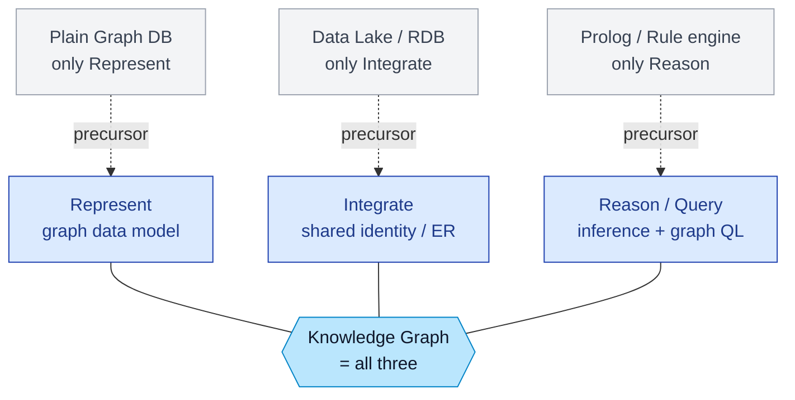
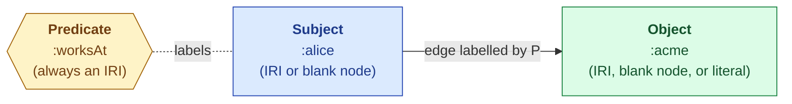
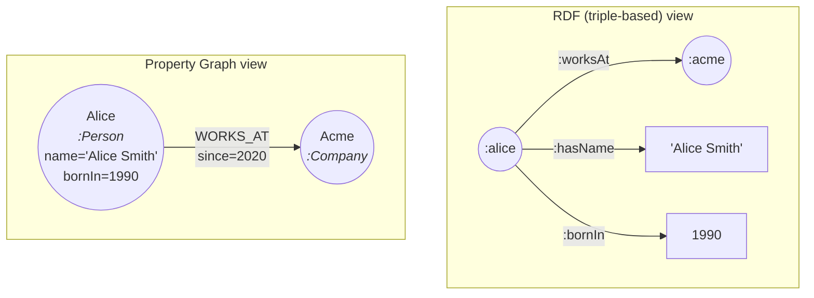
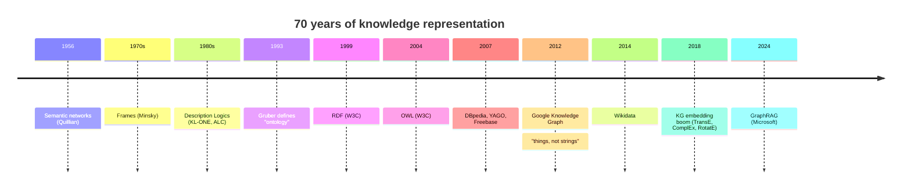
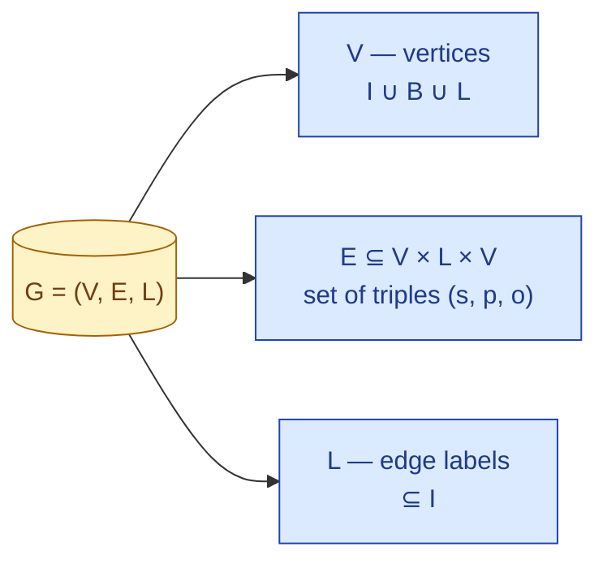
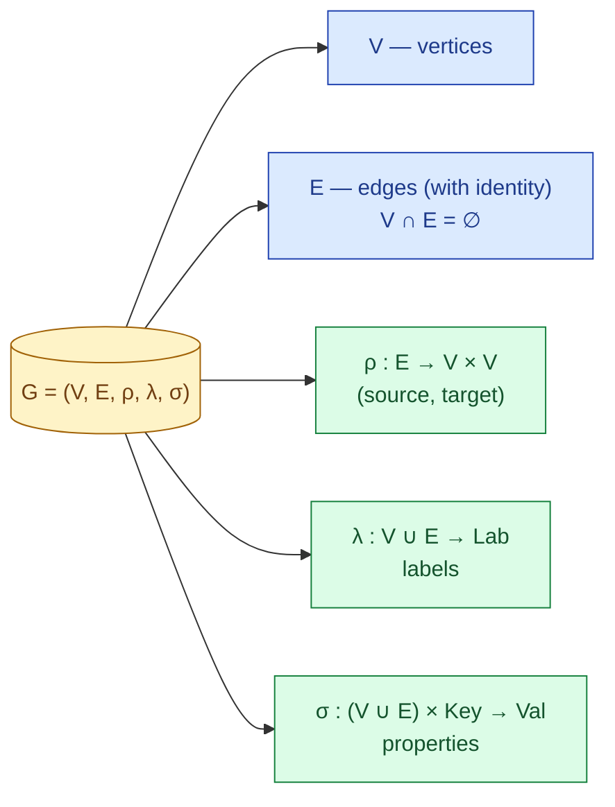
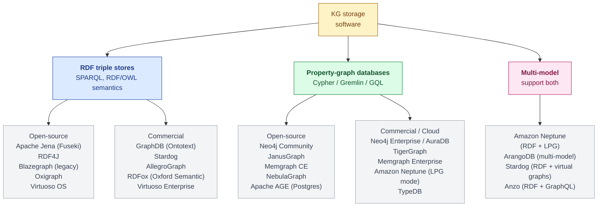
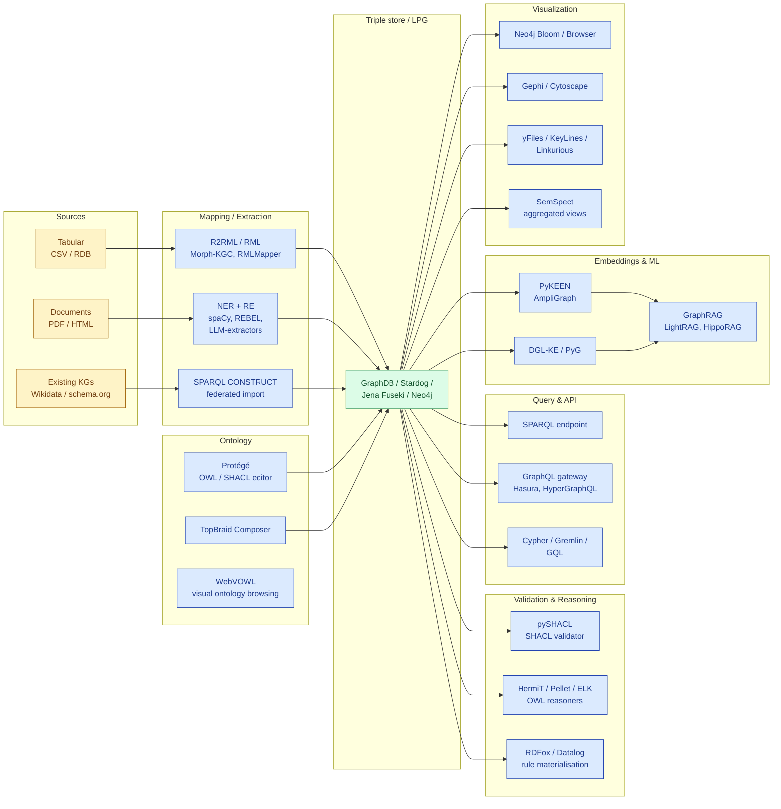

## What are Knowledge Graphs

A **Knowledge Graph** is a graph-structured representation of real-world entities and the relationships between them, intended to accumulate and convey knowledge that can be queried, reasoned over, and continuously enriched.

### The three things a KG must do

 Every KG in practice combines three capabilities:
 
1. **Represent** — entities as nodes, relations as labelled edges, in a graph data model.
2. **Integrate** — fuse data from heterogeneous sources under a shared identity scheme (entity resolution).
3. **Reason / query** — derive new facts via inference, or retrieve facts via a graph query language.

### The four types Knowledge Graph

**Encyclopedic Knowledge Graphs**

- **Purpose:** Represent general, real-world knowledge.
- **Characteristics:** These are the most ubiquitous KGs. They are constructed by integrating massive amounts of information from extensive sources, including human experts, encyclopedias (like Wikipedia), and various databases. Some automatically extract web data to improve over time.
- **Examples:** Wikidata, Freebase, DBpedia, YAGO, NELL, and Knowledge Ocean (KO).

**Commonsense Knowledge Graphs**

- **Purpose:** Formulate knowledge about everyday concepts, objects, events, and their relationships.
- **Characteristics:** Unlike encyclopedic KGs, these model "tacit" knowledge extracted from text (e.g., understanding that a _Car_ is _UsedFor_ a _Drive_). They are crucial for helping computers understand human language meanings and causal effects for reasoning.
- **Examples:** ConceptNet, ATOMIC, ASER, TransOMCS, and CausalBank.

**Domain-specific Knowledge Graphs**

- **Purpose:** Represent highly specialized knowledge within a particular field, such as medicine, biology, finance, geology, chemistry, or genealogy.
- **Characteristics:** Compared to general encyclopedic KGs, they are typically smaller in size but offer much higher accuracy and reliability for their specific domains.
- **Examples:** UMLS (biomedical concepts).

**Multi-modal Knowledge Graphs**

- **Purpose:** Represent facts across multiple modalities, breaking away from conventional text-only data.
- **Characteristics:** They incorporate non-textual information like images, sounds, and videos alongside text. This makes them highly useful for multi-modal tasks like image-text matching, visual question answering, and recommendation systems.
- **Examples:** IMGpedia, MMKG, and Richpedia.

### The two competing data models

There are two popular **Knowledge Graph Data Models**:

|                     | RDF triples                             | Property Graph (LPG)                           |
| ------------------- | --------------------------------------- | ---------------------------------------------- |
| **Atom**            | `(subject, predicate, object)` triple   | Node *with* properties; edge *with* properties |
| **Identity**        | Global IRIs                             | Local internal IDs                             |
| **Schema**          | Optional, separate (RDFS/OWL)           | Optional, often inline (labels)                |
| **Standard query**  | SPARQL                                  | Cypher / GQL / Gremlin                         |
| **Strength**        | Web-scale interop, formal semantics     | Ergonomics, traversal performance              |
| **Weakness**        | Verbose, awkward for n-ary relations    | No standard semantics, weaker reasoning        |
| **Reference impl.** | Apache Jena, GraphDB, Stardog, Virtuoso | Neo4j, TigerGraph, Memgraph                    |

Every RDF fact has exactly three positions. The picture below shows how `Alice worksAt Acme` decomposes, what each position is allowed to be, and how the same fact looks as a subgraph.

In RDF, attributes (`name`, `bornIn`) become extra triples; in LPG they live on the node as key-value properties. The same is true for _edge_ attributes — RDF must reify them, LPG attaches them inline.

### Historical lineage

| Year  | Concept                                                          | Description                                   |
| ----- | ---------------------------------------------------------------- | --------------------------------------------- |
| 1956  | Semantic networks (Quillian)                                     | graphs of concepts, no formal semantics       |
| 1970s | Frames (Minsky)                                                  | slot-and-filler, structured but ad hoc        |
| 1980s | Description Logics (KL-ONE, ALC)                                 | formal, decidable subset of FOL               |
| 1990s | Ontologies (Gruber: "shared conceptualization")                  | vocabularies for AI knowledge sharing         |
| 1999  | **Resource Description Framework** (W3C)                         | triples as the web-scale data model           |
| 2004  | **Web Ontology Language** (W3C)                                  | DL-grounded ontology language on top of RDF   |
| 2007  | DBpedia, YAGO, Freebase                                          | first large-scale public KGs from Wikipedia   |
| 2012  | Google Knowledge Graph                                           | coined the modern term; "things, not strings" |
| 2014  | Wikidata launches                                                | collaborative, multilingual KG                |
| 2018+ | KG embeddings boom (TransE, ComplEx, RotatE) + KG-augmented LLMs | bring KGs into the deep-learning stack        |
| 2024  | GraphRAG (Microsoft)                                             | KGs as the retrieval substrate for LLMs       |

From 2018 onward, knowledge graph (KG) research saw a surge in embedding models (TransE, ComplEx, RotatE) that map entities and relations into continuous vector spaces, enabling link prediction and neural‑driven reasoning. Concurrently, KG‑augmented large language models emerged to ground LLMs with structured, updatable facts, mitigating hallucinations and forming a neuro‑symbolic stack that integrates KGs deeply into deep‑learning pipelines. **This trend directly underpins Retrieval-Augmented Generation (RAG): KGs serve as structured, interpretable knowledge bases for retrieval, with Microsoft’s GraphRAG (2024) as a prominent example.**

## Directed edge-labelled graphs (the RDF view)

A **directed edge-labelled graph** is a tuple
$$G = (V,\ E,\ L)$$where
- $V$ is a finite set of **vertices** (entities, things);
- $L$ is a finite set of **edge labels** (relation names, predicates);
- $E \subseteq V \times L \times V$ is a finite set of **labelled directed edges**.

Each $e = (s, p, o) \in E$ is read "subject $s$ is related to object $o$ via predicate $p$."

## Property graphs (the Neo4j view)

### Definition

A **property graph** is a tuple

$$G = (V,\ E,\ \rho,\ \lambda,\ \sigma)$$

where
- $V$ is a finite set of **vertices**;
- $E$ is a finite set of **edges**, with $V \cap E = \emptyset$;
- $\rho : E \to V \times V$ is the **incidence function** assigning a (source, target) pair to each edge;
- $\lambda : V \cup E \to \mathrm{Lab}$ assigns a **label** to every vertex and edge;
- $\sigma : (V \cup E) \times \mathrm{Key} \to \mathrm{Val}$ is a partial function assigning **key-value properties** to vertices and edges.

The crucial differences from the RDF definition are:

1. **Edges have identity.** $E$ is a separate set, not a subset of $V \times L \times V$. Two edges between the same pair of vertices are distinct objects.
2. **Edges carry properties.** $\sigma$ ranges over $V \cup E$, so an edge `WORKS_AT` can have a `since: 2020` attribute *natively*.
3. **No global identifier alphabet.** Vertices and edges are identified by internal IDs, not IRIs. There is no built-in interoperability story.

### Cypher Language

## Software Ecosystem & Graphical Representation

### Taxonomy of KG storage software

### Toolchain

The store is only the centre of the stack. A real KG project needs **mapping**, **validation**, **ontology authoring**, **query interfaces**, and **embeddings/ML**. The full pipeline:

